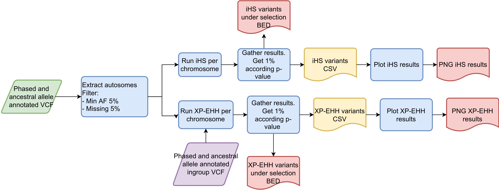
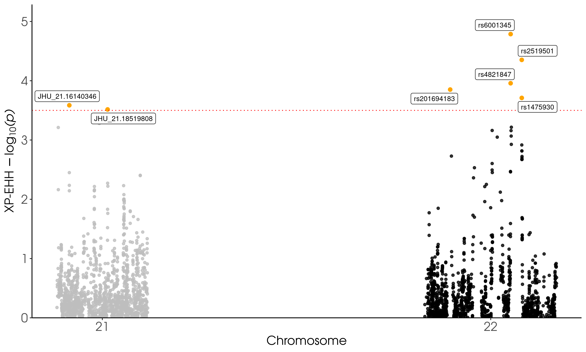

# nf-haplotype-selection

Nextflow pipeline that takes a phased and ancestral allele annotated VCF to compute and run iHS and XP-EHH.

---

### Workflow overview
 

---


### Features
  **-v 0.1.0**

* Supports vcf compressed files as input.
* Results include a two panel of PBS results: Frequency vs PBS and PBS vs Number of SNPs
* Populations could be changed in Nextflow launcher.
* Scalability and reproducibility via a Nextflow-based framework.

---

## Requirements
#### Compatible OS*:
* [Ubuntu 20.04.4 LTS](https://releases.ubuntu.com/focal/)

\* nf-haplotype-selection may run in other UNIX based OS and versions, but testing is required.

#### Software:
| Requirement | Version  | Required Commands * |
|:---------:|:--------:|:-------------------:|
| [bcftools](https://samtools.github.io/bcftools/) | 1.9-220-gc65ba41 | view|
| [Nextflow](https://www.nextflow.io/docs/latest/getstarted.html) | 19.04.1.5072 | nextflow |
| [Plan9 port](https://github.com/9fans/plan9port) | Latest (as of 10/01/2019 ) | mk \** |
| [R](https://www.r-project.org/) | 3.6.4 | Rscript |

\* These commands must be accessible from your `$PATH` (*i.e.* you should be able to invoke them from your command line).  

\** Plan9 port builds many binaries, but you ONLY need the `mk` utility to be accessible from your command line.

Please be sure to have these R libraries installed:
* library(rehh) # 3.2.2
* library("vcfR") 
* library("R.utils")
* library("dplyr")
* library("ggplot2")
* library("ggrepel")

---

### Installation
Download nf-haplotype-selection from Github repository:  
```
git clone https://github.com/jbv2/mxb_selection_signals.git
```

---

#### Test
To test nf-haplotype-selection execution using test data, run:
```
./runtest.sh
```
Your console should print the Nextflow log for the run, once every process has been submitted, the following message will appear:
```
    ======
    nf-haplotype-selection: Basic pipeline TEST SUCCESSFUL
    ======
```

nf-haplotype-selection results for test data should be in the following file:
```
nf-PBS-per-element/test/results/nf-haplotype-selection-results
```

---

### Usage
To run nf-haplotype-selection go to the pipeline directory and execute:
```
nextflow nf-haplotype-selection --vcffile <path to input 1> --min_af <min allele freq> ----geno <Missing genotypes allowed> --min_alleles <2 for snps > --max_alleles <2 for snps > --first_pop <Alias for target pop> --second_pop <Alias for ingroup pop>  --stem_ingroup <Path to ingroup VCF before chromosome>  --end_file_ingroup <rest of ingroup VCF after chromosome> --output_dir [--output_dir path to results ] 
```

For information about options and parameters, run:
```
nextflow run haplotype_selection.nf --help
```

---

### Pipeline Inputs
* A `VCF` file compressed with a `.vcf.gz` extension. A `VCF` file mainly contains meta-information lines, a header and data lines with information about each position. The header names the eigth mandatory columns `CHROM, POS, ID, REF, ALT, QUAL, FILTER, INFO`. 

    VCF must be phased and with ancestral allele annotated.

    Also, it requires the index file with extension `.tbi`

    For more information about the VCF format, please go to the next link: [Variant Call Format](https://www.internationalgenome.org/wiki/Analysis/Variant%20Call%20Format/vcf-variant-call-format-version-40/)

    Example line(s):
```
##fileformat=VCFv4.2
#CHROM	POS	ID	REF	ALT	QUAL	FILTER	INFO	FORMAT	sample1	sample2	sample3
21      9411773 rs867796868     C       T       .       PASS    AC=0;AN=182     GT      0|0     0|0     0|0     0|0
21      10979896        rs117219976     A       G       .       PASS    AC=1;AN=182     GT      0|1     0|0     0|0
22      17176028        rs2845365       T       G       .       PASS    AC=58;AN=182    GT      1|0     0|0     0|1 
```

* `VCF` files compressed with a `.vcf.gz` extension for ingroup population. Files must be split by chromosome and with their index.

### Pipeline Results
iHS and XP-EHH results files with `*.csv` extension.
Columns are: CHR, POSITION, IHS or XP-EHH, LOGPVALUE, P and SNP.

Example line(s):
```
CHR     POSITION        IHS   LOGPVALUE       P       SNP
21      15372509        0.426589572749077       0.174133777524797       0.66967829386848        rs1297083
22      15389721        1.18810484525533        0.629316509295663       0.234792105675127       rs2822368
```

* `*top1.bed` files with iHS values according threshold (p<0.01).
 Columns are chromosome, start, end, iHS.

* A `.png` file with iHS results.


* A `.png` file with XP-EHH results.
 

---

#### References
Under the hood nf-haplotype-selection uses some coding tools, please include the following ciations in your work:

* Narasimhan, V., Danecek, P., Scally, A., Xue, Y., Tyler-Smith, C., & Durbin, R. (2016). BCFtools/RoH: a hidden Markov model approach for detecting autozygosity from next-generation sequencing data. Bioinformatics, 32(11), 1749-1751.
*   R Core Team (2020). R: A language and environment
  for statistical computing. R Foundation for
  Statistical Computing, Vienna, Austria. URL
  https://www.R-project.org/.
* Wickham H, François R, Henry L, Müller K (2022). _dplyr: A Grammar of Data
  Manipulation_. R package version 1.0.9,
  <https://CRAN.R-project.org/package=dplyr>.
* Gautier M, Klassmann A, Vitalis R (2017). “rehh 2.0: a reimplementation of the R package rehh to detect positive selection from haplotype structure.” Molecular Ecology Resources, 17(1), 78-90. doi: 10.1111/1755-0998.12634.
* Knaus BJ, Grünwald NJ (2017). “VCFR: a package to manipulate
  and visualize variant call format data in R.” _Molecular
  Ecology Resources_, *17*(1), 44-53. ISSN 757,
  <http://dx.doi.org/10.1111/1755-0998.12549>.
* Bengtsson H (2022). _R.utils: Various Programming Utilities_.
  R package version 2.12.0,
  <https://CRAN.R-project.org/package=R.utils>.
* H. Wickham. ggplot2: Elegant Graphics for Data Analysis.
  Springer-Verlag New York, 2016.
* Slowikowski K (2021). _ggrepel: Automatically Position
  Non-Overlapping Text Labels with 'ggplot2'_. R package
  version 0.9.1, <https://CRAN.R-project.org/package=ggrepel>.


---

### Contact
If you have questions, requests, or bugs to report, please email <judith.vballesteros@gmail.com> 

#### Dev Team
Judith Ballesteros-Villascán <judith.vballesteros@gmail>