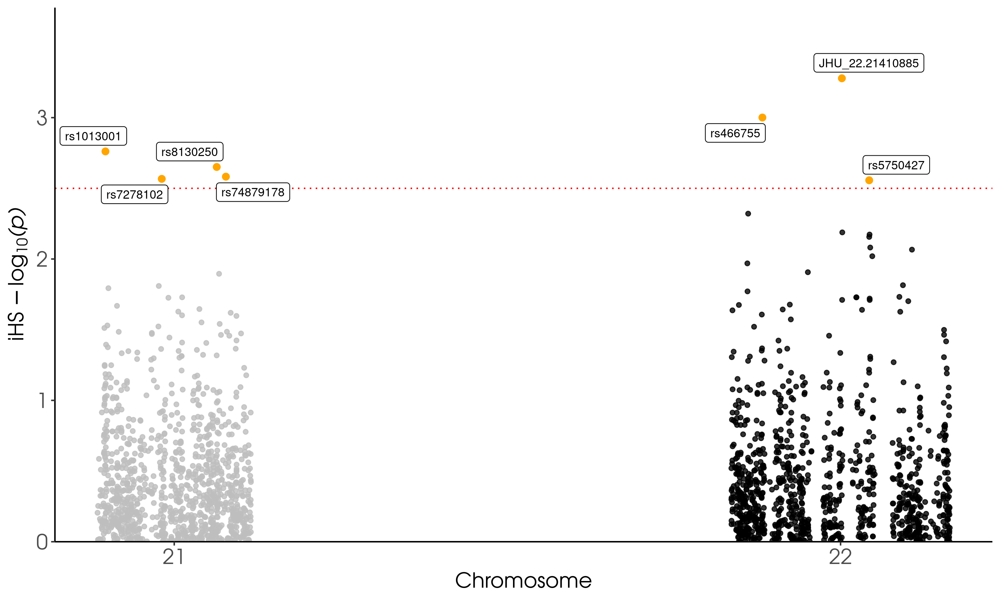

# mk-plot-ihs
**Author(s):**

* Judith Ballesteros Villascán (judith.vballesteros@gmail.com)

**Date:** June 2022

---

## Module description:
Plot iHS results by using plot_ihs.R.

## Module Dependencies:
* plot_ihs.R: Is a tool to plot iHS results from rehh.

    * library("dplyr")
    * library("ggplot2")
    * library("ggrepel")

### Input(s):

* A `.csv` file with IHS results with all chromosomes. 
Example line(s):
```
CHR     POSITION        IHS   LOGPVALUE       P       SNP
21      15372509        0.426589572749077       0.174133777524797       0.66967829386848        rs1297083
22      15389721        1.18810484525533        0.629316509295663       0.234792105675127       rs2822368
```

### Outputs:

* A `.png` file with iHS results.


## Module parameters:
NONE

## Testing the module:

1. Test this module locally by running,
```
bash testmodule.sh
```

2. `[>>>] Module Test Successful` should be printed in the console...

## mk-plot-ihs directory structure

````
mk-plot-ihs  ## Module main directory
├── mkfile  ## File in mk format, specifying the rules for building every result
├── readme.md ## This document. General workflow description.
├── runmk.sh  ## Script to print every file required by this module
├── test  ## Test directory
└── testmodule.sh ## Script to test module functunality using test data

````
## References
* Wickham H, François R, Henry L, Müller K (2022). _dplyr: A
  Grammar of Data Manipulation_. R package version 1.0.9,
  <https://CRAN.R-project.org/package=dplyr>.
* H. Wickham. ggplot2: Elegant Graphics for Data Analysis.
  Springer-Verlag New York, 2016.
* Slowikowski K (2021). _ggrepel: Automatically Position
  Non-Overlapping Text Labels with 'ggplot2'_. R package
  version 0.9.1, <https://CRAN.R-project.org/package=ggrepel>.