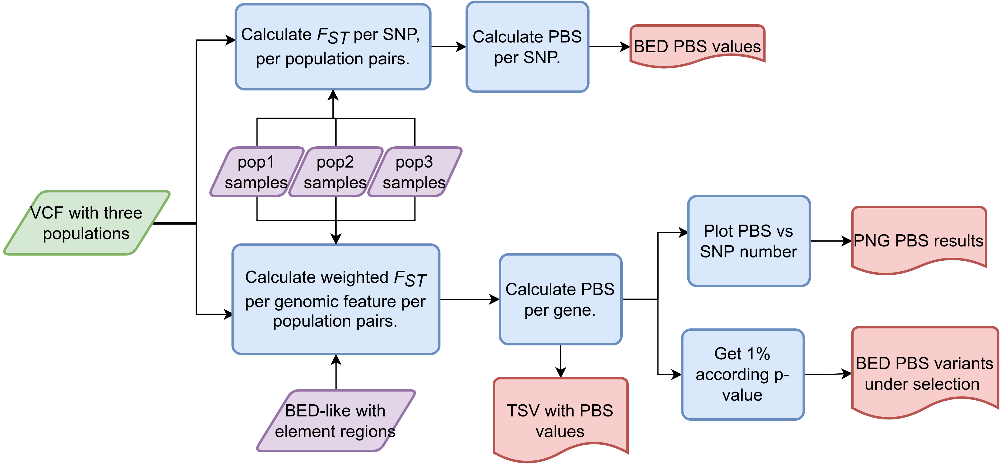

# nf-PBS-per-element

Nextflow pipeline that takes a three pop vcf, runs and computes PBS per element region and SNP.

---

### Workflow overview


---


### Features
  **-v 0.1.0**

* Supports vcf compressed files as input.
* Results include a two panel of PBS results: Frequency vs PBS and PBS vs Number of SNPs
* Populations could be changed in Nextflow launcher.
* Scalability and reproducibility via a Nextflow-based framework.

---

## Requirements
#### Compatible OS*:
* [Ubuntu 20.04.4 LTS](https://releases.ubuntu.com/focal/)

\* nf-PBS-per-element may run in other UNIX based OS and versions, but testing is required.

#### Software:
| Requirement | Version  | Required Commands * |
|:---------:|:--------:|:-------------------:|
| [bcftools](https://samtools.github.io/bcftools/) | 1.9-220-gc65ba41 | view|
| [vcftools](http://vcftools.sourceforge.net/) | 0.1.16 | --weir-fst-pop |
| [Nextflow](https://www.nextflow.io/docs/latest/getstarted.html) | 19.04.1.5072 | nextflow |
| [Plan9 port](https://github.com/9fans/plan9port) | Latest (as of 10/01/2019 ) | mk \** |
| [R](https://www.r-project.org/) | 3.6.4 | Rscript |

\* These commands must be accessible from your `$PATH` (*i.e.* you should be able to invoke them from your command line).  

\** Plan9 port builds many binaries, but you ONLY need the `mk` utility to be accessible from your command line.

Please be sure to have these R libraries installed:
* dplyr
* tidyr
* ggplot2
* cowplot

---

### Installation
Download nf-PBS-per-element from Github repository:  
```
git clone https://github.com/jbv2/mxb_selection_signals.git
```

---

#### Test
To test nf-PBS-per-element execution using test data, run:
```
./runtest.sh
```

    Your console should print the Nextflow log for the run, once every process has been submitted, the following message will appear:
    ```
    ======
    nf-PBS-per-element: Basic pipeline TEST SUCCESSFUL
    ======
    ```

nf-PBS-per-element results for test data should be in the following file:
```
nf-PBS-per-element/test/results/nf-PBS-per-element-results
```

---

### Usage
To run nf-PBS-per-element go to the pipeline directory and execute:
```
nextflow run pbs_per_element.nf --vcffile <path to input 1> --ref_gene <path to BED elements> --pop_outgroup <File with samples of outgroup > --pop_ingroup <File with samples of ingroup > --pop_target <File with samples of target > --pop_1 <Alias for target pop> --pop_2 <Alias for ingroup pop> --pop_3 <Alias for outgroup pop> --output_dir [--output_dir path to results ] 
```

For information about options and parameters, run:
```
nextflow run pbs_per_element.nf --help
```

---

### Pipeline Inputs
* A VCF file with a .vcf extension. A VCF file mainly contains meta-information lines, a header and data lines with information about each position. The header names the eight mandatory columns CHROM, POS, ID, REF, ALT, QUAL, FILTER, INFO.

For more information about the VCF format, please go to the following link: Variant Call Format.

Example line(s):
```
##fileformat=VCFv4.2
#CHROM	POS	ID	REF	ALT	QUAL	FILTER	INFO	FORMAT	sample1	sample2	sample3
chr1	778597	rs74512038	C	T	6290.29	PASS	BaseQRankSum=-1.05;ClippingRankSum=0;ExcessHet=2.3451;FS=10.853;InbreedingCoeff=0.0097;MQ=69.78;MQRankSum=0;POSITIVE_TRAIN_SITE;QD=15.12;ReadPosRankSum=-0.678;SOR=0.306;VQSLOD=9.88;culprit=MQRankSum;NS=2504;AA=.|||;VT=SNP;GRCH37_POS=713977;GRCH37_REF=C;GRCH37_38_REF_STRING_MATCH;DP=18077;AF=0.0825688;MLEAC=17;MLEAF=0.109;EAS_AF=0.2083;AMR_AF=0.0648;AFR_AF=0.0098;EUR_AF=0.003;SAS_AF=0.0297;AN=160;AC=17	GT:AD:DP:GQ:PL	0/0:32,0:32:90:0,90,1350	0/0:36,0:36:99:0,99,1406	0/0:17,0:17:51:0,51,534
chr1	779047	rs12028261	G	A	61525.2	PASS	BaseQRankSum=0.697;ClippingRankSum=0;ExcessHet=0.7322;FS=0;InbreedingCoeff=0.1074;MQ=66.21;MQRankSum=-0.174;POSITIVE_TRAIN_SITE;QD=30.78;ReadPosRankSum=0.23;SOR=0.686;VQSLOD=4.48;culprit=MQRankSum;NS=2504;AA=.|||;VT=SNP;GRCH37_POS=714427;GRCH37_REF=G;GRCH37_38_REF_STRING_MATCH;DP=15427;AF=0.795872;MLEAC=139;MLEAF=0.891;EAS_AF=0.7917;AMR_AF=0.8718;AFR_AF=0.4546;EUR_AF=0.9493;SAS_AF=0.9315;AN=160;AC=142	GT:AD:DP:GQ:PGT:PID:PL	1/1:0,17:17:51:.:.:580,51,0	1/1:0,27:27:81:.:.:923,81,0	1/1:0,17:17:51:.:.:601,51,0
```

* A bed like input with the coordinates of the element to calculate Fst.

The file must have columns: Chromosome, start end, and name elements.

Example line(s):
```
21      16236888        16248352        CATG00000055555.1
21      16437368        16440572        AF127577.12
21      30671217        30734078        BACH1-IT1
22      27610621        27620640        RP5-1172A22.1
22      30993828        31002674        RP1-56J10.8
22      41055598        41080925        CATG00000058689.1
22      41807132        41809946        CATG00000058714.1
```

* Files with samples name per population. One sample per line.
Example line(s):
```
Sample1
Sample2
Sample3
```

### Pipeline Results
PBS results file with `*.tsv` extension.
Columns are: Chromosome, Start, End, Element, SNP number and PBS.
Filename is `target_ingroup_outgroup_pbs.tsv`.

```
Chromosome      Start   End     Element         SNP number      PBS
21      16236888        16248352        CATG00000055555.1       7       0
21      16437368        16440572        AF127577.12     8       0.010039
21      30671217        30734078        BACH1-IT1       15      0.987942
22      27610621        27620640        RP5-1172A22.1   5       0.010817
22      30993828        31002674        RP1-56J10.8     3       2.098515
22      41055598        41080925        CATG00000058689.1       12      0.685469
```
* A bed file with the top 1% of PBS values.

* A `.png` file with PBS plots.


---

#### References
Under the hood nf-PBS-per-element uses some coding tools, please include the following ciations in your work:

* Narasimhan, V., Danecek, P., Scally, A., Xue, Y., Tyler-Smith, C., & Durbin, R. (2016). BCFtools/RoH: a hidden Markov model approach for detecting autozygosity from next-generation sequencing data. Bioinformatics, 32(11), 1749-1751.
*   R Core Team (2020). R: A language and environment
  for statistical computing. R Foundation for
  Statistical Computing, Vienna, Austria. URL
  https://www.R-project.org/.
* Wickham H, François R, Henry L, Müller K (2022). _dplyr: A Grammar of Data
  Manipulation_. R package version 1.0.9,
  <https://CRAN.R-project.org/package=dplyr>.
* Wickham H, Girlich M (2022). _tidyr: Tidy Messy Data_. R package version
  1.2.0, <https://CRAN.R-project.org/package=tidyr>.
* The Variant Call Format and VCFtools, Petr Danecek, Adam Auton, Goncalo Abecasis, Cornelis A. Albers, Eric Banks, Mark A. DePristo, Robert Handsaker, Gerton Lunter, Gabor Marth, Stephen T. Sherry, Gilean McVean, Richard Durbin and 1000 Genomes Project Analysis Group, Bioinformatics, 2011
* The Variant Call Format and VCFtools, Petr Danecek, Adam Auton, Goncalo Abecasis, Cornelis A. Albers, Eric Banks, Mark A. DePristo, Robert Handsaker, Gerton Lunter, Gabor Marth, Stephen T. Sherry, Gilean McVean, Richard Durbin and 1000 Genomes Project Analysis Group, Bioinformatics, 2011

---

### Contact
If you have questions, requests, or bugs to report, please email <judith.vballesteros@gmail.com> 

#### Dev Team
Judith Ballesteros-Villascán <judith.vballesteros@gmail>