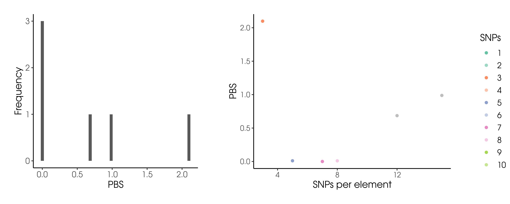

# mk-plot-pbs-per-element
**Author(s):**

* Judith Ballesteros Villascán (judith.vballesteros@gmail.com)

**Date:** June 2022

---

## Module description:
Plot PBS per element by using plot_pbs.R. 

## Module Dependencies:
* plot_pbs.R.: Is a tool that plots PBS frequency and the SNP number vs PBS, highlighting 1-10 SNPs regions.
    
    * dplyr 
    * ggplot2
    * cowplot

### Input(s):

PBS results file with `*.tsv` extension.
Columns are: Chromosome, Start, End, Element, SNP number and PBS.
Filename is `target_ingroup_outgroup_pbs.tsv`.

```
Chromosome      Start   End     Element         SNP number      PBS
21      16236888        16248352        CATG00000055555.1       7       0
21      16437368        16440572        AF127577.12     8       0.010039
21      30671217        30734078        BACH1-IT1       15      0.987942
22      27610621        27620640        RP5-1172A22.1   5       0.010817
22      30993828        31002674        RP1-56J10.8     3       2.098515
22      41055598        41080925        CATG00000058689.1       12      0.685469
```

### Outputs:

A `.png` file with PBS plots.


## Module parameters:
NONE

## Testing the module:

1. Test this module locally by running,
```
bash testmodule.sh
```

2. `[>>>] Module Test Successful` should be printed in the console...

## mk-plot-pbs-per-element directory structure

````
mk-plot-pbs-per-element  ## Module main directory
├── mkfile  ## File in mk format, specifying the rules for building every result
├── readme.md ## This document. General workflow description.
├── runmk.sh  ## Script to print every file required by this module
├── test  ## Test directory
└── testmodule.sh ## Script to test module functunality using test data
````

## References
*   R Core Team (2020). R: A language and environment
  for statistical computing. R Foundation for
  Statistical Computing, Vienna, Austria. URL
  https://www.R-project.org/.
* Wickham H, François R, Henry L, Müller K (2022). _dplyr: A Grammar of Data
  Manipulation_. R package version 1.0.9,
  <https://CRAN.R-project.org/package=dplyr>.
* Wickham H (2016). ggplot2: Elegant Graphics for Data Analysis. Springer-Verlag New York. ISBN 978-3-319-24277-4, https://ggplot2.tidyverse.org.
* Claus O. Wilke (2020). cowplot: Streamlined Plot Theme and Plot Annotations for 'ggplot2'. R package
  version 1.1.1. https://CRAN.R-project.org/package=cowplot